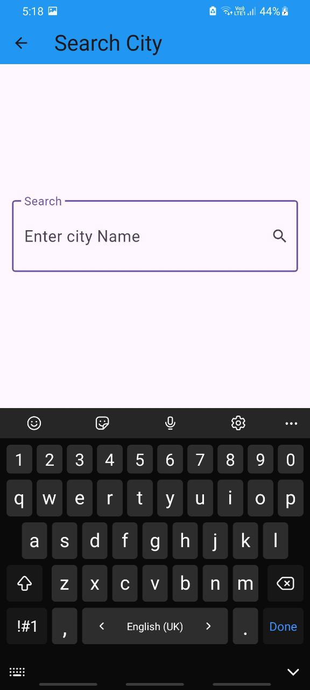
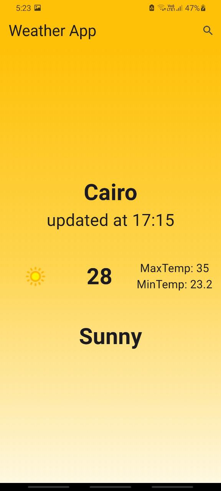
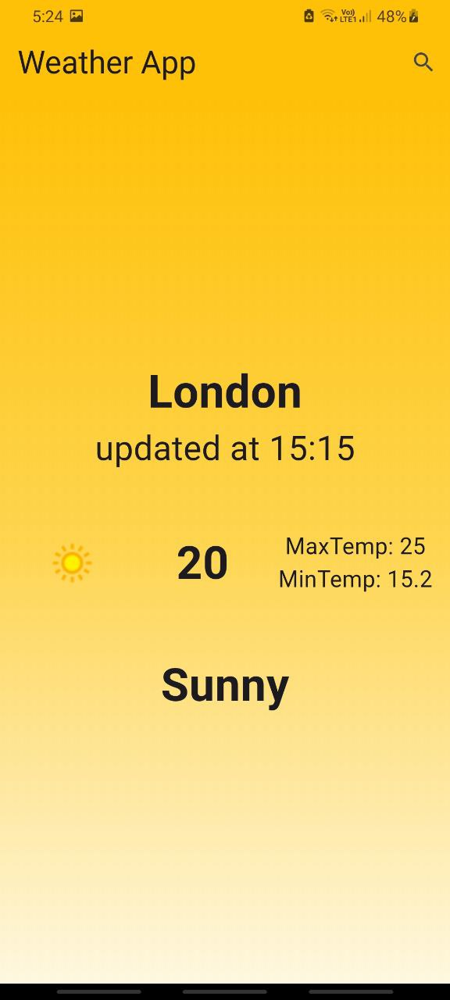

# 🌦️ Weather App Nassar

A **Flutter weather application** powered by [WeatherAPI](https://www.weatherapi.com/) that allows users to search for any city and get real-time weather updates with a clean and dynamic UI.

The app uses **BLoC (Cubit)** state management for reactive UI updates and adapts its **theme colors dynamically** based on the current weather condition.

---

## ✨ Features

* 🔍 **Search for city weather**
* 🌡️ **Shows current temperature, max/min temperature**
* 🖼️ **Weather condition with icon**
* 🎨 **Dynamic theme & gradient background** (changes based on weather)
* 📅 **Last updated time**
* ❌ **Graceful error handling** for failed requests
* 🚀 Built with **Flutter + Dio + BLoC**

---

## 📸 Screenshots

| Search Screen                              | Home Screen                              | Weather Info                                                                              |
| ------------------------------------------ | ---------------------------------------- | ----------------------------------------------------------------------------------------- |
|  |  |   |

---

## 🛠️ Tech Stack

* **Flutter** (UI)
* **BLoC (Cubit)** (State Management)
* **Dio** (Networking)
* **WeatherAPI** (Weather data provider)

---

## 📂 Project Structure

```
lib/
 ┣ cubits/
 ┃ ┗ get_weather_cubit/
 ┃   ┣ get_weather_cubit.dart
 ┃   ┗ get_weather_states.dart
 ┣ model/
 ┃ ┗ weather_model.dart
 ┣ service/
 ┃ ┗ weather_service.dart
 ┣ view/
 ┃ ┣ HomeView.dart
 ┃ ┣ SearchView.dart
 ┃ ┣ WeatherInfoBody.dart
 ┃ ┗ NoWeatherApp.dart
 ┣ widget/
 ┃ ┗ (custom widgets if any)
 ┣ main.dart
```

---

## 🚀 Getting Started

### 1️⃣ Prerequisites

* [Flutter SDK](https://flutter.dev/docs/get-started/install)
* An API key from [WeatherAPI](https://www.weatherapi.com/)

### 2️⃣ Installation

Clone the repository:

```bash
git clone https://github.com/your-username/weather_app_nassar.git
cd weather_app_nassar
```

Install dependencies:

```bash
flutter pub get
```

### 3️⃣ Add API Key

Replace the API key in `weather_service.dart`:

```dart
final String apiKey = "YOUR_API_KEY";
```

*(For better security, you can store it in a `.env` file using [flutter\_dotenv](https://pub.dev/packages/flutter_dotenv)).*

### 4️⃣ Run the app

```bash
flutter run
```

---

## 🎨 Dynamic Theme Example

The app theme color changes based on weather conditions:

* ☀️ **Sunny / Clear** → Amber
* ☁️ **Cloudy / Overcast** → Grey
* 🌧️ **Rainy** → Blue / Indigo
* ❄️ **Snowy** → Cyan / Light Blue
* ⚡ **Thunderstorm** → Deep Purple

---

## ⚠️ Known Issues

* Make sure you’re connected to the internet.
* If the app crashes with `Null check operator used on a null value`, search for a city first to initialize the weather model.

---

## 📌 Future Improvements

* 🌍 Add location-based weather (GPS)
* 📊 Add 7-day forecast
* 🎨 Improve UI/UX animations

---

## 🤝 Contributing

Contributions, issues, and feature requests are welcome!
Feel free to open a pull request.

---

## 📜 License

This project is licensed under the **MIT License** – see the [LICENSE](LICENSE) file for details.

---

## 👨‍💻 Author

**Abdelrahman Atef Mohamed Nassar**

* 💼 [LinkedIn](https://www.linkedin.com/in/Abdelrahman-Nassar-dev253)
* 🐙 [GitHub](https://github.com/Abdelrahmannassar10)

